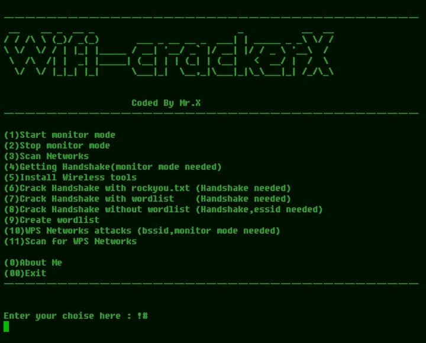

# Wifi-crackerX 

<h2>


     
  </h2>
  <hr>

## introduction
<p align="center">
Wifi-crackerX is a tool for hacking a WPS/WPA/WPA2 Networks
  </details>

## Instalations
```
$ sudo apt-get update && apt-get install git
$ sudo git clone https://github.com/Whomrx666/Wifi-crackerX 
$ cd Wifi-crackerX 
$ sudo python3 Wifi-crackerX.py
```

## Instructions
- **First**: Install the tools above according to the instructions above
- **Second**: Choose one of the tools that you will use
- **Third**: Use tools according to your needs, what WiFi network you want to hack 
- **Last**: And the tools will do their job

# All menu
| Features | ✔️ |
|--------|--------|
| **Start monitor mode** |✔️ |
| **Stop monitor mode** |✔️ |
| **Scan Networks** |✔️ |
| **Getting Handshake** |✔️ |
| **Create wordlist** |✔️ |
| **Install Wireless tools** |✔️ |
| **WPS Networks attacks** |✔️ |
| **Scan for WPS Networks** |✔️ |
| **Crack Handshake with rockyou.txt** |✔️ |
| **Crack Handshake with wordlist** |✔️ |
| **Crack Handshake without wordlist** |✔️ |
| **About Me** |✔️ |
---------

##Note
Use a rooted cellphone or run it on a Linux-based terminal

## Observation
This is a tool for education only, I am not responsible for any misuse
### Original Author
<a href="https://github.com/Whomrx666"></a>

### <<< If you copy , Then Give me The Credits >>>

## CONNECT WITH ME :

[](https://whomrxhackers.blogspot.com/)
[](https://twitter.com/whomrx666)
[](https://youtube.com/@whomrx666)
[](https://facebook.com/https://www.facebook.com/whomrx.666)
[](https://t.me/@Whomr_X)
[](mailto:whomrx666@gmail.com)
[](https://www.tiktok.com/@whomr.x)

**If you want to donate, click on the button**
<a href="https://saweria.co/whomrx"></a>

### Visitors :
